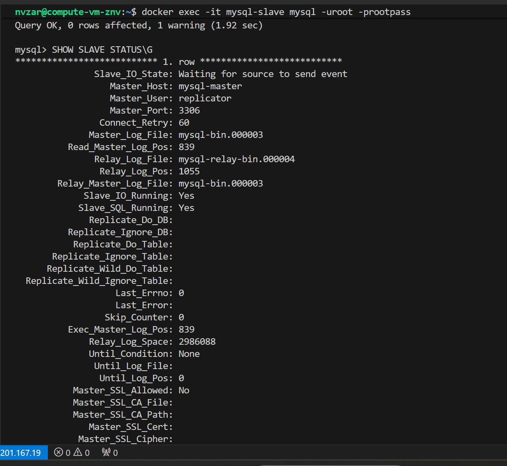

 Домашнее задание к занятию «Репликация и масштабирование. Часть 1»

**Выполнил:** Зарубов Николай

---

## Задание 1

**Вопрос:** На лекции рассматривались режимы репликации master-slave, master-master, опишите их различия.

### Ответ:

#### Репликация Master-Slave

**Master-Slave** репликация — это классическая схема репликации, в которой одна ведущая база данных (master) отвечает за все операции записи, а несколько ведомых серверов (slave) получают копии этих изменений и используются только для чтения данных.

**Принцип работы:**
1. Master-сервер записывает все изменения данных в двоичный журнал (binary log)
2. Slave-сервер копирует изменения из двоичного журнала master в свой журнал ретрансляции (relay log)
3. Slave воспроизводит изменения из relay log, применяя их к собственным данным

**Преимущества:**
- Простота настройки и администрирования
- Отказоустойчивость — slave-серверы служат горячими резервными копиями
- Масштабируемость чтения — запросы на чтение можно распределить между slave-серверами, снижая нагрузку на master
- Возможность создания резервных копий на slave без влияния на производительность master
- Аварийное восстановление — защита данных от аппаратных сбоев

**Недостатки:**
- Master является единой точкой отказа для операций записи
- Не ускоряет операции записи — все записи идут только на master
- При отказе master требуется ручное или автоматическое переключение на slave
- Не обеспечивает High Availability уровня 99,999%
- Возможна задержка репликации между master и slave

**Применение:** подходит для большинства приложений, где преобладают операции чтения над операциями записи.

---

#### Репликация Master-Master

**Master-Master** репликация (также называется круговой или circular replication) — это конфигурация, в которой каждый сервер является одновременно и master, и slave. Это означает, что на все серверы можно выполнять операции записи, и эти изменения синхронизируются между всеми участниками репликации.

**Принцип работы:**
1. Каждый сервер является master для другого
2. Изменения, сделанные на одном сервере, реплицируются на другие
3. Каждый сервер ведет свой binary log и читает binary log других серверов
4. По сути, это две встречные Master-Slave репликации

**Преимущества:**
- Отсутствие единой точки отказа для записи
- Теоретически максимальная High Availability
- При отказе одного сервера система продолжает работать на других
- Балансировка нагрузки записи между серверами
- Не требуется ручное переключение при отказе одного из серверов

**Недостатки:**
- **Проблемы с консистентностью** — если два master-сервера одновременно изменяют одни и те же данные, возникают конфликты
- Отсутствие автоматического разрешения конфликтов в MySQL
- Сложность администрирования
- Не масштабирует запись эффективно — данные все равно должны синхронизироваться между всеми master
- Требуется настройка auto_increment_increment и auto_increment_offset для избежания конфликтов первичных ключей
- Более высокая сложность отладки проблем

**Применение:** используется когда требуется высокая доступность для операций записи и можно гарантировать, что разные master не будут одновременно изменять одни и те же данные. Часто применяется в географически распределенных системах.

---

#### Основные различия

| Характеристика | Master-Slave | Master-Master |
|----------------|--------------|---------------|
| **Операции записи** | Только на master | На любом сервере |
| **Операции чтения** | На master и slave | На любом сервере |
| **Точка отказа** | Master — единая точка отказа | Нет единой точки отказа |
| **Консистентность** | Гарантирована | Возможны конфликты |
| **Сложность настройки** | Простая | Сложная |
| **Масштабируемость чтения** | Высокая | Высокая |
| **Масштабируемость записи** | Низкая | Средняя |
| **Задержка репликации** | Возможна | Возможна |
| **High Availability** | Средняя | Высокая |
| **Разрешение конфликтов** | Не требуется | Требуется вручную |
| **Применение** | Большинство приложений | Критичные к доступности системы |

---

## Задание 2

**Задание:** Выполните конфигурацию master-slave репликации, примером можно пользоваться из лекции. Приложите скриншоты конфигурации, выполнения работы: состояния и режимы работы серверов.

### Ответ:

Для выполнения задания была настроена репликация Master-Slave с использованием Docker Compose. Ниже представлена конфигурация и скриншоты работы.

#### Конфигурационные файлы

**docker-compose.yml:**
```yaml
version: '3.8'

services:
  mysql-master:
    image: mysql:8.0
    container_name: mysql-master
    environment:
      MYSQL_ROOT_PASSWORD: rootpassword
      MYSQL_DATABASE: testdb
    volumes:
      - ./master/data:/var/lib/mysql
      - ./master/my.cnf:/etc/mysql/my.cnf
    ports:
      - "3306:3306"
    networks:
      - mysql-network

  mysql-slave:
    image: mysql:8.0
    container_name: mysql-slave
    environment:
      MYSQL_ROOT_PASSWORD: rootpassword
    volumes:
      - ./slave/data:/var/lib/mysql
      - ./slave/my.cnf:/etc/mysql/my.cnf
    ports:
      - "3307:3306"
    depends_on:
      - mysql-master
    networks:
      - mysql-network

networks:
  mysql-network:
    driver: bridge
```

**master/my.cnf:**
```ini
[mysqld]
server-id = 1
log_bin = /var/log/mysql/mysql-bin.log
binlog_do_db = testdb
```

**slave/my.cnf:**
```ini
[mysqld]
server-id = 2
relay-log = /var/log/mysql/mysql-relay-bin.log
log_bin = /var/log/mysql/mysql-bin.log
binlog_do_db = testdb
```

#### Шаги настройки репликации

**На Master-сервере:**

1. Создание пользователя для репликации:
```sql
CREATE USER 'repl'@'%' IDENTIFIED WITH mysql_native_password BY 'slavepass';
GRANT REPLICATION SLAVE ON *.* TO 'repl'@'%';
FLUSH PRIVILEGES;
```

2. Получение статуса master:
```sql
SHOW MASTER STATUS;
```

#### Скриншоты проверки репликации

- Статус master-сервера  
    
  (скриншот с результатом `SHOW MASTER STATUS;`)

- Данные на master  
    
  (скриншот с результатом `SELECT * FROM test_table;` на master)

- Статус slave-сервера  
    
  (скриншот с результатом `SHOW SLAVE STATUS\G` на slave)

- Реплицированные данные на slave  
    
  (скриншот с результатом `SELECT * FROM test_table;` на slave)

#### Продолжение проверки репликации

**На Slave-сервере:**

1. Настройка подключения к master:
```sql
CHANGE MASTER TO
  MASTER_HOST='mysql-master',
  MASTER_USER='repl',
  MASTER_PASSWORD='slavepass',
  MASTER_LOG_FILE='mysql-bin.000001',
  MASTER_LOG_POS=157;
```

2. Запуск репликации:
```sql
START SLAVE;
```

3. Проверка статуса:
```sql
SHOW SLAVE STATUS\G;
```

**На Master:**
```sql
USE testdb;
CREATE TABLE test_table (
  id INT AUTO_INCREMENT PRIMARY KEY,
  name VARCHAR(100),
  created_at TIMESTAMP DEFAULT CURRENT_TIMESTAMP
);

INSERT INTO test_table (name) VALUES ('Запись 1'), ('Запись 2'), ('Запись 3');
SELECT * FROM test_table;
```

**На Slave:**
```sql
USE testdb;
SELECT * FROM test_table;
```
